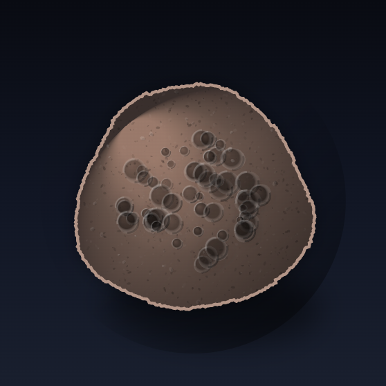

# Hash-Based Moon Rock Shape Generator

A deterministic, browser-only moon-rock generator built as a BRC-102 frontend project.

## Live Site

- Production URL: <http://frontend.a268b0290a244086fb72c1ad16d148e9.projects.babbage.systems/>



## What it does

- Enter any text seed and generate a **stable** moon-rock specimen.
- SHA-256 of the input is used as the seed input.
- A seeded pseudo-random pipeline generates:
  - rock silhouette and contour
  - crater density/placement
  - fracture behavior and striation patterns
  - shadowing, occlusion, and reflective grain
- Rendering is performed entirely in the browser with Canvas.
- Same text always resolves to the exact same rock.

## Repository structure

- `frontend/`
  - Vite + React application
  - `frontend/src/App.jsx` contains deterministic render logic
  - `frontend/src/styles.css` visual system
- `deployment-info.json`
  - BRC-102 metadata for LARS/CARS workflows
- `assets/moon1.png`
  - Featured sample image used in docs

## Run locally

```bash
npm run install:tooling
npm run install:frontend
npm run dev
```

Then open the local dev URL.

## Build & preview

```bash
npm run build
npm run preview
```

## LARS / CARS workflow

This project is configured for BSV tooling.

- `npm run lars` launches local LARS.
- `npm run cars` runs CARS CLI entrypoint for deployment tasks.

Update `deployment-info.json` before deploying:

- set a real `projectID`
- set `CARSCloudURL`
- pick network (`testnet`/`mainnet`) for your target

## Deployment config summary

- `schema`: `bsv-app`
- `schemaVersion`: `1.0`
- `frontend.language`: `react`
- `frontend.sourceDirectory`: `./frontend`
- `configs`
  - `Local LARS`: provider `LARS` on `testnet`
  - `production`: provider `CARS` over HTTPS

## Design goals

1. Deterministic behavior from any input.
2. Visual depth with realistic moon-like color science.
3. Fast iteration loop for artists and collectors.
4. Clear path from local preview to BRC-102 deployment.

## Notes

CARS build artifacts and local runtime state are ignored in Git. If you add new local deployment outputs, include them in `.gitignore` as needed.
